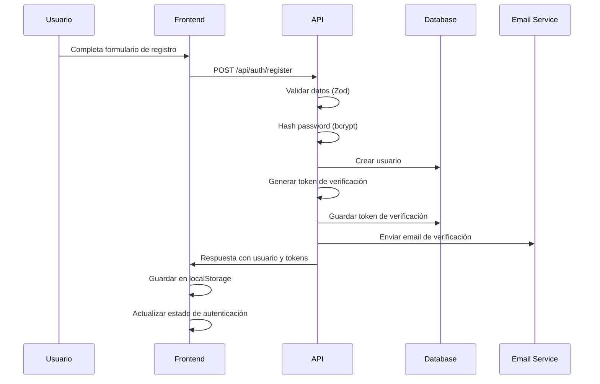
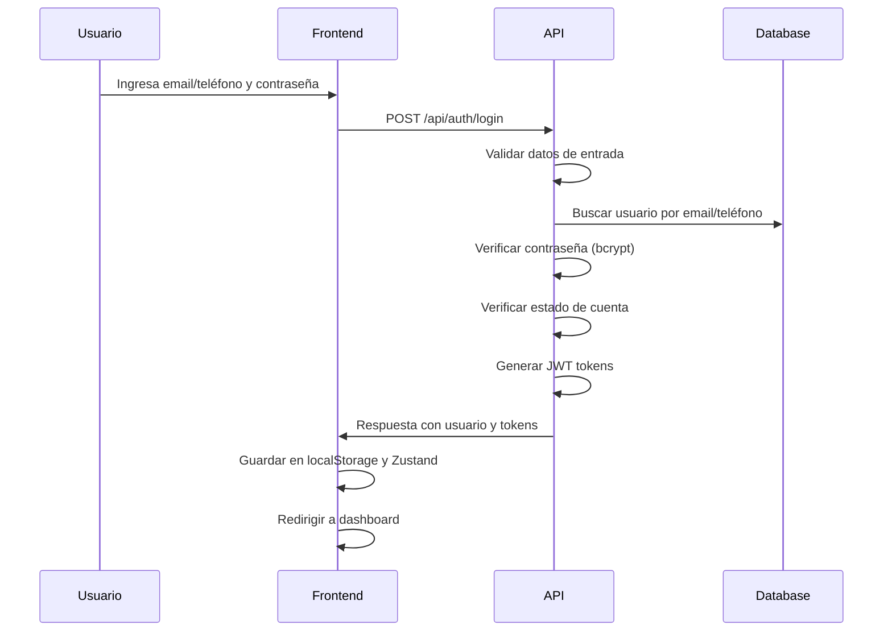
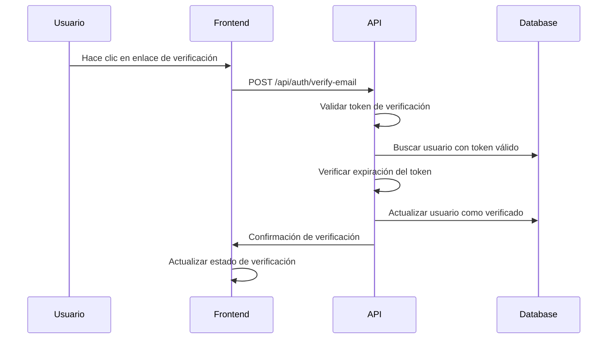
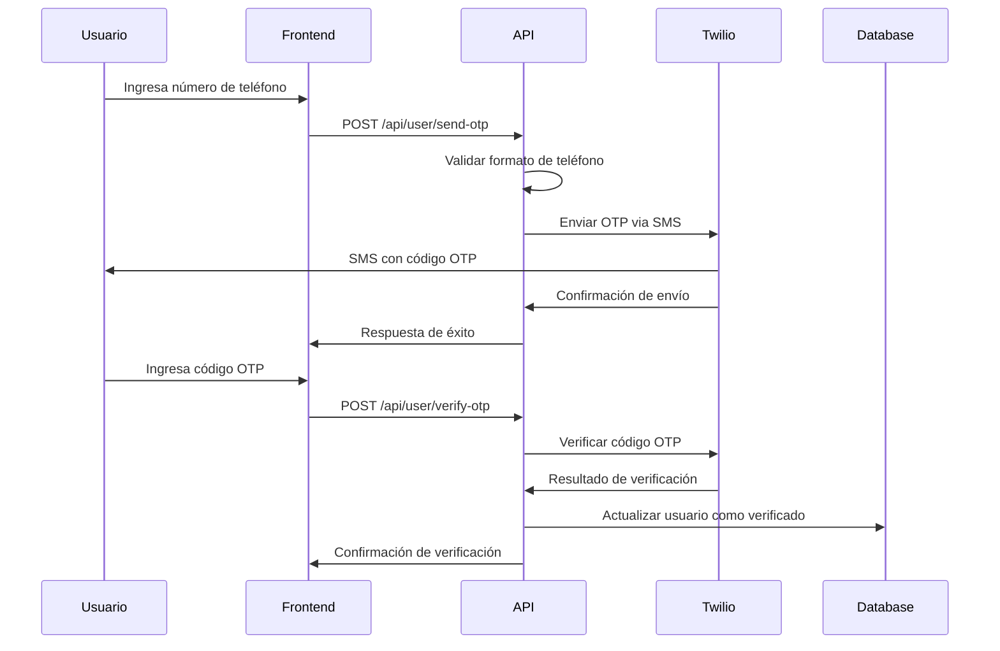
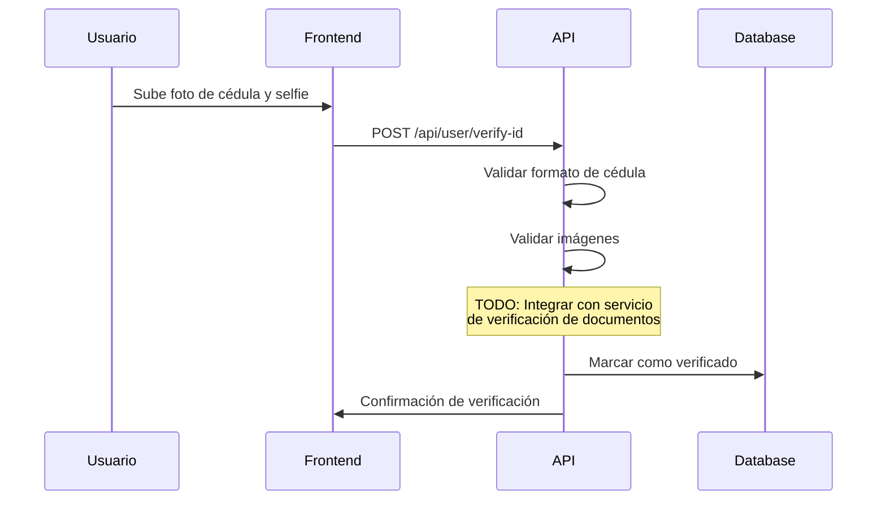

# Documentación del Sistema de Autenticación y Verificación

## Tabla de Contenidos

1. [Resumen Ejecutivo](#resumen-ejecutivo)
2. [Arquitectura del Sistema](#arquitectura-del-sistema)
3. [Flujo de Autenticación](#flujo-de-autenticación)
4. [Verificación por Teléfono (OTP)](#verificación-por-teléfono-otp)
5. [Verificación de Identidad (ID)](#verificación-de-identidad-id)
6. [Gestión de Tokens JWT](#gestión-de-tokens-jwt)
7. [Seguridad y Validaciones](#seguridad-y-validaciones)
8. [API Endpoints](#api-endpoints)
9. [Configuración y Variables de Entorno](#configuración-y-variables-de-entorno)
10. [Manejo de Errores](#manejo-de-errores)
11. [Logging y Monitoreo](#logging-y-monitoreo)

---

## Resumen Ejecutivo

El sistema de autenticación de Tigrito Web implementa un flujo completo de autenticación con múltiples capas de verificación:

- **Autenticación básica**: Login con email/teléfono y contraseña
- **Verificación de email**: Token de verificación por correo electrónico
- **Verificación por teléfono**: Sistema OTP con Twilio
- **Verificación de identidad**: Validación con cédula y reconocimiento facial
- **Gestión de sesiones**: Tokens JWT con refresh tokens
- **Control de acceso**: Middleware basado en roles (CLIENT, PROFESSIONAL, ADMIN)

---

## Arquitectura del Sistema

### Componentes Principales

```
┌─────────────────────────────────────────────────────────────┐
│                    FRONTEND (React/Next.js)                │
├─────────────────────────────────────────────────────────────┤
│  • AuthContext (React Context)                             │
│  • useAuthStore (Zustand Store)                            │
│  • Auth Hooks (React Query)                                │
│  • UI Components (shadcn/ui)                               │
└─────────────────────────────────────────────────────────────┘
                                │
                                ▼
┌─────────────────────────────────────────────────────────────┐
│                    API LAYER (Next.js API Routes)          │
├─────────────────────────────────────────────────────────────┤
│  • /api/auth/login                                          │
│  • /api/auth/register                                       │
│  • /api/auth/verify-email                                   │
│  • /api/user/verify-otp                                     │
│  • /api/user/verify-id                                      │
└─────────────────────────────────────────────────────────────┘
                                │
                                ▼
┌─────────────────────────────────────────────────────────────┐
│                 BUSINESS LOGIC LAYER                        │
├─────────────────────────────────────────────────────────────┤
│  • JWT Token Management                                     │
│  • Password Hashing (bcrypt)                               │
│  • OTP Service (Twilio)                                     │
│  • Validation Schemas (Zod)                                │
│  • Authentication Middleware                               │
└─────────────────────────────────────────────────────────────┘
                                │
                                ▼
┌─────────────────────────────────────────────────────────────┐
│                    DATA LAYER                               │
├─────────────────────────────────────────────────────────────┤
│  • Prisma ORM                                               │
│  • PostgreSQL Database                                      │
│  • Redis (para OTP storage)                                │
└─────────────────────────────────────────────────────────────┘
```

### Tecnologías Utilizadas

- **Frontend**: React, Next.js, TypeScript, Zustand, React Query
- **Backend**: Next.js API Routes, Prisma ORM
- **Base de Datos**: PostgreSQL
- **Autenticación**: JWT, bcrypt
- **OTP**: Twilio Verify API
- **Validación**: Zod schemas
- **UI**: shadcn/ui components

---

## Flujo de Autenticación

### 1. Registro de Usuario



**Archivos involucrados:**
- `src/app/api/auth/register/route.ts`
- `src/lib/schemas/auth.ts`
- `src/lib/auth/password.ts`
- `src/hooks/auth/useRegister.ts`

### 2. Login de Usuario



**Características del Login:**
- Soporte para login con email O teléfono
- Validación de contraseña con bcrypt
- Verificación de estado de cuenta (suspendida)
- Generación de access token y refresh token
- Logging detallado para auditoría

### 3. Verificación de Email



---

## Verificación por Teléfono (OTP)

### Arquitectura del Sistema OTP

El sistema de verificación por teléfono utiliza Twilio Verify API para el envío y validación de códigos OTP.

### Flujo de Verificación OTP



### Configuración de Twilio

**Variables de Entorno Requeridas:**
```env
TWILIO_ACCOUNT_SID=your_account_sid
TWILIO_AUTH_TOKEN=your_auth_token
TWILIO_PHONE_NUMBER=your_twilio_phone
TWILIO_VERIFY_SERVICE_SID=your_verify_service_sid
```

### Funcionalidades del Sistema OTP

#### 1. Envío de OTP (`generateOTP`)

**Ubicación:** `src/lib/services/otp.ts`

```typescript
export async function generateOTP(phoneNumber: string): Promise<{
  success: boolean;
  message: string;
  expiresIn?: number;
}>
```

**Características:**
- Formateo automático a formato E.164 (+58 para Venezuela)
- Integración con Twilio Verify API
- Modo mock para desarrollo
- Manejo de errores específicos de Twilio
- Almacenamiento temporal de intentos de verificación

#### 2. Verificación de OTP (`verifyOTP`)

**Ubicación:** `src/lib/services/otp.ts`

```typescript
export async function verifyOTP(
  phoneNumber: string,
  code: string
): Promise<{
  verified: boolean;
  message: string;
  remainingAttempts?: number;
}>
```

**Características:**
- Validación con Twilio Verify API
- Control de intentos (máximo 3)
- Limpieza automática de códigos expirados
- Manejo de errores específicos

#### 3. Reenvío de OTP (`resendOTP`)

```typescript
export async function resendOTP(phoneNumber: string): Promise<{
  success: boolean;
  message: string;
  expiresIn?: number;
}>
```

### Validaciones de Teléfono

**Formato esperado:** `04XXXXXXXXX` (11 dígitos, comenzando con 04)

**Validación en frontend:**
```typescript
phoneNumber: z.string()
  .regex(/^04\d{9}$/, 'Phone must be in format 04120386216')
  .min(11, 'Phone is required')
```

**Formateo automático:**
- `04120386216` → `+584120386216`
- `4120386216` → `+584120386216`
- `0584120386216` → `+584120386216`

### Estados de Verificación

```typescript
interface VerificationEntry {
  phoneNumber: string;
  verificationSid: string;
  createdAt: Date;
  attempts: number;
  verified: boolean;
}
```

### Manejo de Errores OTP

| Código Twilio | Descripción | Acción |
|---------------|-------------|---------|
| 60200 | Formato de teléfono inválido | Mostrar error de formato |
| 60202 | Código de verificación inválido | Mostrar error de código |
| 60203 | Máximo de intentos alcanzado | Solicitar nuevo OTP |
| 60212 | Demasiadas solicitudes concurrentes | Esperar y reintentar |
| 60223 | Código de verificación expirado | Solicitar nuevo OTP |
| 20404 | Servicio de verificación no encontrado | Error de configuración |
| 20003 | Fallo de autenticación | Error de configuración |

---

## Verificación de Identidad (ID)

### Flujo de Verificación de Identidad



### Validaciones de Cédula

**Formato:** 7-8 dígitos numéricos
**Validación:** `^\d{7,8}$`

### Datos Requeridos

```typescript
interface IDVerificationRequest {
  cedula: string;           // 7-8 dígitos
  cedulaImage: string;      // Base64 data URL
  faceScanData: string;     // Base64 data URL
}
```

### Estado Actual

⚠️ **Nota:** La verificación de identidad está implementada como placeholder. En producción se requiere integrar con:
- Servicio de verificación de documentos (Onfido, AWS Rekognition)
- Servicio de reconocimiento facial
- Sistema anti-fraude

---

## Gestión de Tokens JWT

### Estructura del Token

```typescript
interface JWTPayload {
  userId: string;
  role: 'CLIENT' | 'PROFESSIONAL' | 'ADMIN';
  email?: string;
  phone?: string;
  iat: number;  // Issued at
  exp: number;  // Expires at
}
```

### Configuración de Tokens

```env
JWT_SECRET=your_jwt_secret_key
JWT_EXPIRES_IN=24h
JWT_REFRESH_EXPIRES_IN=7d
```

### Tipos de Tokens

1. **Access Token**
   - Duración: 24 horas
   - Uso: Autenticación en requests
   - Almacenamiento: localStorage

2. **Refresh Token**
   - Duración: 7 días
   - Uso: Renovar access tokens
   - Almacenamiento: localStorage

### Funciones de Gestión

**Generación:**
```typescript
generateAccessToken(payload: Omit<JWTPayload, 'iat' | 'exp'>): string
generateRefreshToken(payload: Omit<JWTPayload, 'iat' | 'exp'>): string
```

**Validación:**
```typescript
validateToken(token: string): { success: true; payload: JWTPayload } | { success: false; error: string }
```

**Refresh:**
```typescript
refreshToken(refreshToken: string): { success: true; accessToken: string } | { success: false; error: string }
```

---

## Seguridad y Validaciones

### Validación de Contraseñas

**Requisitos mínimos:**
- Mínimo 8 caracteres
- Al menos una mayúscula
- Al menos una minúscula
- Al menos un número
- Al menos un carácter especial

**Implementación:**
```typescript
export function validatePasswordStrength(password: string): { valid: boolean; errors: string[] }
```

### Hash de Contraseñas

**Algoritmo:** bcrypt con 12 rounds de salt
```typescript
export async function hashPassword(password: string): Promise<string>
export async function verifyPassword(password: string, hashedPassword: string): Promise<boolean>
```

### Middleware de Autenticación

**Ubicación:** `src/lib/auth/middleware.ts`

**Funciones disponibles:**
- `authenticateRequest()` - Autenticación básica
- `requireRole(allowedRoles)` - Control por roles
- `requireAdmin()` - Solo administradores
- `requireProfessionalOrAdmin()` - Profesionales y administradores
- `requireAuth()` - Cualquier usuario autenticado
- `requireOwnership(userId)` - Verificar propiedad de recurso

### Validaciones de Entrada

**Schemas Zod:**
- `LoginRequestSchema` - Validación de login
- `RegisterRequestSchema` - Validación de registro
- `OTPSendRequestSchema` - Validación de envío OTP
- `OTPVerifyRequestSchema` - Validación de verificación OTP
- `IDVerificationRequestSchema` - Validación de verificación ID

---

## API Endpoints

### Autenticación

| Endpoint | Método | Descripción | Autenticación |
|----------|--------|-------------|---------------|
| `/api/auth/login` | POST | Login de usuario | No |
| `/api/auth/register` | POST | Registro de usuario | No |
| `/api/auth/verify-email` | POST | Verificar email | No |
| `/api/auth/refresh` | POST | Renovar token | No |

### Verificación

| Endpoint | Método | Descripción | Autenticación |
|----------|--------|-------------|---------------|
| `/api/user/send-otp` | POST | Enviar OTP | Sí |
| `/api/user/verify-otp` | POST | Verificar OTP | Sí |
| `/api/user/verify-id` | POST | Verificar identidad | Sí |

### Estructura de Respuestas

**Éxito:**
```json
{
  "success": true,
  "data": { ... },
  "message": "Operation successful"
}
```

**Error:**
```json
{
  "success": false,
  "error": {
    "code": "ERROR_CODE",
    "message": "Error description",
    "details": { ... }
  }
}
```

---

## Configuración y Variables de Entorno

### Variables Requeridas

```env
# Database
DATABASE_URL="postgresql://..."

# JWT
JWT_SECRET="your_jwt_secret_key"
JWT_EXPIRES_IN="24h"
JWT_REFRESH_EXPIRES_IN="7d"

# Twilio (OTP)
TWILIO_ACCOUNT_SID="your_account_sid"
TWILIO_AUTH_TOKEN="your_auth_token"
TWILIO_PHONE_NUMBER="your_twilio_phone"
TWILIO_VERIFY_SERVICE_SID="your_verify_service_sid"

# Email (opcional)
SMTP_HOST="smtp.gmail.com"
SMTP_PORT="587"
SMTP_USER="your_email@gmail.com"
SMTP_PASS="your_app_password"
```

### Configuración de Desarrollo

Para desarrollo local, el sistema OTP funciona en modo mock cuando Twilio no está configurado.

---

## Manejo de Errores

### Códigos de Error Estándar

```typescript
export const COMMON_ERROR_CODES = {
  VALIDATION_ERROR: 'VALIDATION_ERROR',
  UNAUTHORIZED: 'UNAUTHORIZED',
  FORBIDDEN: 'FORBIDDEN',
  NOT_FOUND: 'NOT_FOUND',
  CONFLICT: 'CONFLICT',
  INTERNAL_ERROR: 'INTERNAL_ERROR',
} as const;
```

### Estrategias de Manejo

1. **Validación de entrada:** Zod schemas
2. **Autenticación:** Middleware JWT
3. **Autorización:** Control por roles
4. **Rate limiting:** Control de intentos OTP
5. **Logging:** Logs estructurados para auditoría

---

## Logging y Monitoreo

### Sistema de Logging

**Ubicación:** `src/lib/utils/logger.ts`

**Niveles de log:**
- `info` - Información general
- `warn` - Advertencias
- `error` - Errores
- `securityEvent` - Eventos de seguridad

### Eventos Auditados

- Intentos de login (exitosos y fallidos)
- Generación de tokens
- Verificaciones OTP
- Cambios de estado de usuario
- Errores de autenticación

### Métricas de Seguridad

- Intentos de login fallidos por IP
- Tokens expirados
- Verificaciones OTP fallidas
- Tiempo de respuesta de autenticación

---

## Consideraciones de Producción

### Mejoras Recomendadas

1. **Rate Limiting:** Implementar límites de requests por IP
2. **Session Management:** Implementar blacklist de tokens
3. **Monitoring:** Integrar con servicios de monitoreo (DataDog, New Relic)
4. **Backup:** Estrategia de backup para tokens de verificación
5. **Scaling:** Considerar Redis para almacenamiento de sesiones

### Seguridad Adicional

1. **2FA:** Implementar autenticación de dos factores
2. **Device Management:** Control de dispositivos autorizados
3. **Geolocation:** Validación por ubicación geográfica
4. **Biometric:** Integración con autenticación biométrica

---

## Conclusión

El sistema de autenticación de Tigrito Web proporciona una base sólida y segura para la gestión de usuarios, con múltiples capas de verificación y un diseño escalable. La implementación actual cubre los casos de uso principales mientras mantiene la flexibilidad para futuras mejoras y integraciones.

Para cualquier pregunta o aclaración sobre la implementación, consultar los archivos fuente correspondientes o contactar al equipo de desarrollo.
