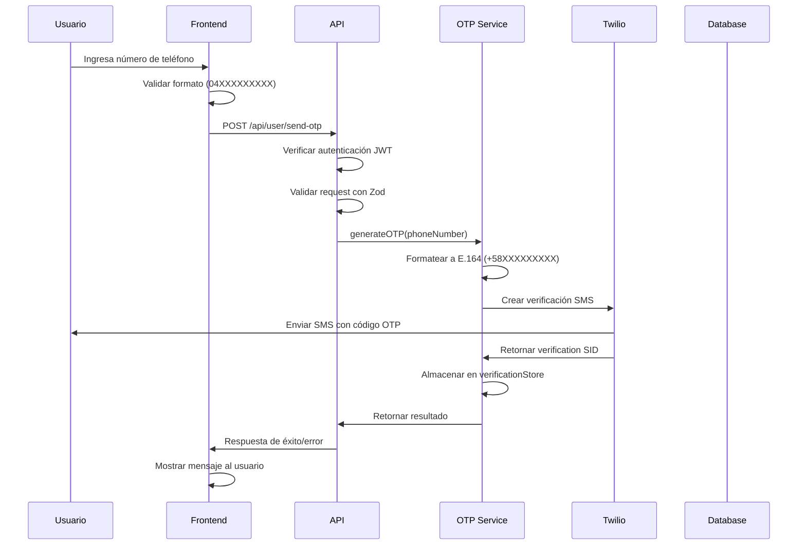
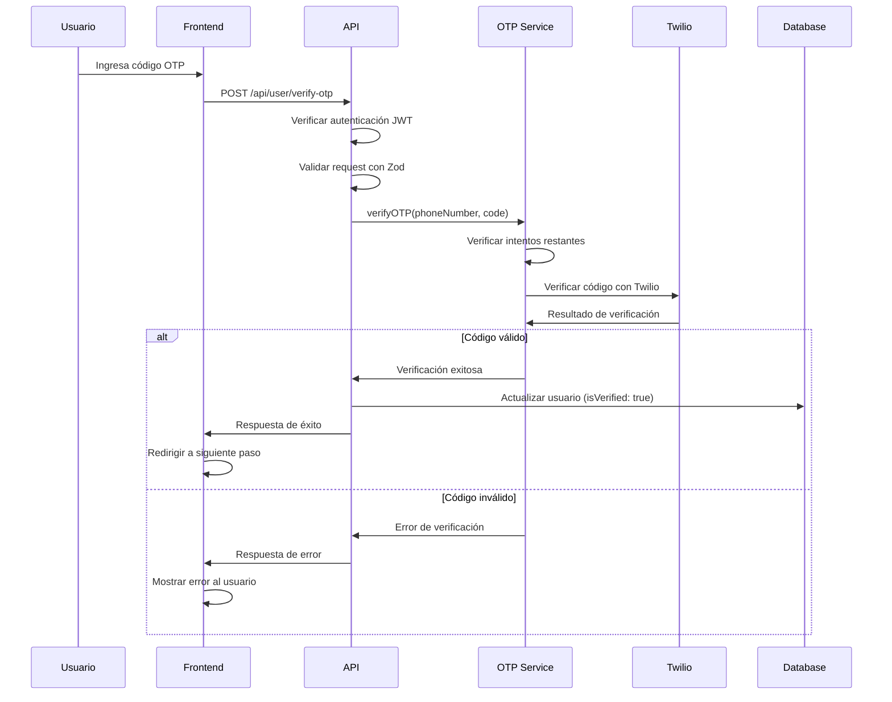

# Documentación Específica: Verificación por Teléfono (OTP)

## Tabla de Contenidos

1. [Resumen del Sistema OTP](#resumen-del-sistema-otp)
2. [Arquitectura Técnica](#arquitectura-técnica)
3. [Flujo Detallado de Verificación](#flujo-detallado-de-verificación)
4. [Integración con Twilio](#integración-con-twilio)
5. [Configuración y Setup](#configuración-y-setup)
6. [API Endpoints Específicos](#api-endpoints-específicos)
7. [Validaciones y Formatos](#validaciones-y-formatos)
8. [Manejo de Estados](#manejo-de-estados)
9. [Manejo de Errores](#manejo-de-errores)
10. [Testing y Desarrollo](#testing-y-desarrollo)
11. [Consideraciones de Producción](#consideraciones-de-producción)

---

## Resumen del Sistema OTP

El sistema de verificación por teléfono de Tigrito Web implementa un flujo completo de OTP (One-Time Password) utilizando la API de Twilio Verify. Este sistema permite:

- **Envío de códigos OTP** via SMS a números de teléfono venezolanos
- **Verificación de códigos** con control de intentos y expiración
- **Formateo automático** de números de teléfono al formato E.164
- **Modo de desarrollo** con simulación de códigos OTP
- **Manejo robusto de errores** con códigos específicos de Twilio

---

## Arquitectura Técnica

### Componentes del Sistema

```
┌─────────────────────────────────────────────────────────────┐
│                    FRONTEND LAYER                          │
├─────────────────────────────────────────────────────────────┤
│  • PhoneVerificationForm Component                         │
│  • OTPVerificationForm Component                          │
│  • useSendOTP Hook (React Query)                          │
│  • useVerifyOTP Hook (React Query)                        │
└─────────────────────────────────────────────────────────────┘
                                │
                                ▼
┌─────────────────────────────────────────────────────────────┐
│                    API LAYER                               │
├─────────────────────────────────────────────────────────────┤
│  • /api/user/send-otp (POST)                              │
│  • /api/user/verify-otp (POST)                            │
└─────────────────────────────────────────────────────────────┘
                                │
                                ▼
┌─────────────────────────────────────────────────────────────┐
│                 OTP SERVICE LAYER                          │
├─────────────────────────────────────────────────────────────┤
│  • generateOTP() - Envío de códigos                        │
│  • verifyOTP() - Verificación de códigos                   │
│  • resendOTP() - Reenvío de códigos                        │
│  • cleanupExpiredVerifications() - Limpieza                │
└─────────────────────────────────────────────────────────────┘
                                │
                                ▼
┌─────────────────────────────────────────────────────────────┐
│                 TWILIO INTEGRATION                         │
├─────────────────────────────────────────────────────────────┤
│  • Twilio Verify API                                       │
│  • SMS Delivery Service                                    │
│  • Verification Status Tracking                            │
└─────────────────────────────────────────────────────────────┘
```

### Archivos Principales

```
src/
├── lib/
│   └── services/
│       └── otp.ts                    # Servicio principal OTP
├── app/
│   └── api/
│       └── user/
│           ├── send-otp/
│           │   └── route.ts          # Endpoint de envío
│           └── verify-otp/
│               └── route.ts          # Endpoint de verificación
├── hooks/
│   └── verification/
│       ├── useSendOTP.ts             # Hook de envío
│       └── useVerifyOTP.ts           # Hook de verificación
├── components/
│   └── verification/
│       ├── PhoneVerificationForm.tsx # Formulario de teléfono
│       └── OTPVerificationForm.tsx   # Formulario de OTP
└── lib/
    └── schemas/
        └── otp.ts                    # Schemas de validación
```

---

## Flujo Detallado de Verificación

### 1. Envío de OTP



### 2. Verificación de OTP



---

## Integración con Twilio

### Configuración de Twilio

**Variables de Entorno Requeridas:**
```env
TWILIO_ACCOUNT_SID=ACxxxxxxxxxxxxxxxxxxxxxxxxxxxxxxxx
TWILIO_AUTH_TOKEN=your_auth_token_here
TWILIO_PHONE_NUMBER=+1234567890
TWILIO_VERIFY_SERVICE_SID=VAxxxxxxxxxxxxxxxxxxxxxxxxxxxxxxxx
```

### Inicialización del Cliente

```typescript
// src/lib/services/otp.ts
const accountSid = process.env.TWILIO_ACCOUNT_SID;
const authToken = process.env.TWILIO_AUTH_TOKEN;
const twilioPhoneNumber = process.env.TWILIO_PHONE_NUMBER;
const verifyServiceSid = process.env.TWILIO_VERIFY_SERVICE_SID;

const isTwilioConfigured = !!(accountSid && authToken && twilioPhoneNumber);

let twilioClient: any = null;
if (isTwilioConfigured) {
  try {
    const twilio = require('twilio');
    twilioClient = twilio(accountSid, authToken);
    console.log('📱 [OTP Service] Twilio client initialized successfully');
  } catch (error) {
    console.error('📱 [OTP Service] Failed to initialize Twilio client:', error);
  }
}
```

### Envío de OTP con Twilio

```typescript
export async function generateOTP(phoneNumber: string): Promise<{
  success: boolean;
  message: string;
  expiresIn?: number;
}> {
  try {
    const formattedPhone = formatPhoneNumber(phoneNumber);
    
    // Crear verificación con Twilio
    const verification = await twilioClient.verify.v2
      .services(verifyServiceSid)
      .verifications.create({
        to: formattedPhone,
        channel: 'sms',
        locale: 'es', // Español para Venezuela
      });

    // Almacenar información de verificación
    const verificationEntry: VerificationEntry = {
      phoneNumber: formattedPhone,
      verificationSid: verification.sid,
      createdAt: new Date(),
      attempts: 0,
      verified: false,
    };

    verificationStore.set(phoneNumber, verificationEntry);

    return {
      success: true,
      message: 'OTP sent successfully',
      expiresIn: OTP_EXPIRATION_MINUTES * 60,
    };
  } catch (error) {
    // Manejo de errores específicos de Twilio
    return handleTwilioError(error);
  }
}
```

### Verificación de OTP con Twilio

```typescript
export async function verifyOTP(
  phoneNumber: string,
  code: string
): Promise<{
  verified: boolean;
  message: string;
  remainingAttempts?: number;
}> {
  try {
    const formattedPhone = formatPhoneNumber(phoneNumber);
    
    // Verificar código con Twilio
    const verificationCheck = await twilioClient.verify.v2
      .services(verifyServiceSid)
      .verificationChecks.create({
        to: formattedPhone,
        code: code.trim(),
      });

    // Incrementar intentos
    const verificationEntry = verificationStore.get(phoneNumber);
    if (verificationEntry) {
      verificationEntry.attempts++;
    }

    if (verificationCheck.valid) {
      verificationEntry.verified = true;
      return {
        verified: true,
        message: 'Phone number verified successfully',
      };
    } else {
      return {
        verified: false,
        message: 'Invalid verification code',
        remainingAttempts: MAX_ATTEMPTS - verificationEntry.attempts,
      };
    }
  } catch (error) {
    return handleTwilioError(error);
  }
}
```

---

## Configuración y Setup

### 1. Instalación de Dependencias

```bash
# Working directory: /home/julio/workspace/mvp_tigrito_web
cd /home/julio/workspace/mvp_tigrito_web && npm install twilio
```

### 2. Configuración de Twilio

1. **Crear cuenta en Twilio:**
   - Registrarse en [twilio.com](https://www.twilio.com)
   - Verificar número de teléfono
   - Obtener Account SID y Auth Token

2. **Configurar Verify Service:**
   - Ir a Verify > Services en la consola de Twilio
   - Crear nuevo servicio
   - Copiar Service SID

3. **Configurar variables de entorno:**
   ```env
   TWILIO_ACCOUNT_SID=ACxxxxxxxxxxxxxxxxxxxxxxxxxxxxxxxx
   TWILIO_AUTH_TOKEN=your_auth_token_here
   TWILIO_PHONE_NUMBER=+1234567890
   TWILIO_VERIFY_SERVICE_SID=VAxxxxxxxxxxxxxxxxxxxxxxxxxxxxxxxx
   ```

### 3. Configuración de Desarrollo

Para desarrollo local sin Twilio configurado, el sistema funciona en modo mock:

```typescript
// Modo mock automático cuando Twilio no está configurado
if (!isTwilioConfigured || !twilioClient) {
  console.log('📱 [OTP Service] Using mock mode - Twilio not configured');
  
  const mockCode = Math.floor(100000 + Math.random() * 900000).toString();
  console.log(`📱 [OTP Service] Mock mode - OTP: ${mockCode}`);
  
  return {
    success: true,
    message: 'OTP sent successfully (mock mode)',
    expiresIn: OTP_EXPIRATION_MINUTES * 60,
  };
}
```

---

## API Endpoints Específicos

### POST /api/user/send-otp

**Descripción:** Envía un código OTP al número de teléfono especificado.

**Headers:**
```
Authorization: Bearer <jwt_token>
Content-Type: application/json
```

**Request Body:**
```json
{
  "phoneNumber": "04120386216"
}
```

**Response Success (200):**
```json
{
  "success": true,
  "data": {
    "message": "OTP sent successfully",
    "expiresIn": 600
  },
  "message": "OTP sent successfully"
}
```

**Response Error (400):**
```json
{
  "success": false,
  "error": {
    "code": "VALIDATION_ERROR",
    "message": "Phone must be in format 04120386216",
    "details": [
      {
        "code": "invalid_string",
        "expected": "04120386216",
        "received": "123",
        "path": ["phoneNumber"]
      }
    ]
  }
}
```

### POST /api/user/verify-otp

**Descripción:** Verifica el código OTP enviado por el usuario.

**Headers:**
```
Authorization: Bearer <jwt_token>
Content-Type: application/json
```

**Request Body:**
```json
{
  "phoneNumber": "04120386216",
  "otpCode": "123456"
}
```

**Response Success (200):**
```json
{
  "success": true,
  "data": {
    "message": "Phone number verified successfully",
    "verified": true
  },
  "message": "Phone number verified successfully"
}
```

**Response Error (400):**
```json
{
  "success": false,
  "error": {
    "code": "VALIDATION_ERROR",
    "message": "Invalid verification code",
    "details": {
      "remainingAttempts": 2
    }
  }
}
```

---

## Validaciones y Formatos

### Formato de Número de Teléfono

**Formato esperado en frontend:** `04XXXXXXXXX` (11 dígitos)

**Validación Zod:**
```typescript
export const OTPSendRequestSchema = z.object({
  phoneNumber: z.string()
    .regex(/^04\d{9}$/, 'Phone must be in format 04120386216')
    .min(11, 'Phone is required'),
});
```

**Formateo automático a E.164:**
```typescript
function formatPhoneNumber(phoneNumber: string): string {
  const cleaned = phoneNumber.replace(/\D/g, '');
  
  // Asumir números venezolanos (agregar prefijo +58)
  if (cleaned.startsWith('0')) {
    return `+58${cleaned.substring(1)}`;
  }
  
  if (cleaned.startsWith('58')) {
    return `+${cleaned}`;
  }
  
  return `+58${cleaned}`;
}
```

### Ejemplos de Formateo

| Input | Output |
|-------|--------|
| `04120386216` | `+584120386216` |
| `4120386216` | `+584120386216` |
| `0584120386216` | `+584120386216` |
| `584120386216` | `+584120386216` |

### Validación de Código OTP

**Formato:** Código numérico de 4-8 dígitos
**Validación:** Solo números, sin espacios ni caracteres especiales

---

## Manejo de Estados

### Estados de Verificación

```typescript
interface VerificationEntry {
  phoneNumber: string;        // Número formateado E.164
  verificationSid: string;    // SID de Twilio
  createdAt: Date;           // Timestamp de creación
  attempts: number;          // Intentos realizados
  verified: boolean;         // Estado de verificación
}
```

### Flujo de Estados

```
1. INICIAL
   ↓ (usuario solicita OTP)
2. OTP_SENT
   ↓ (usuario ingresa código)
3. VERIFYING
   ↓ (código válido)
4. VERIFIED
   ↓ (código inválido)
5. FAILED
   ↓ (máximo intentos)
6. EXPIRED
```

### Control de Intentos

**Configuración:**
```typescript
const MAX_ATTEMPTS = 3;
const OTP_EXPIRATION_MINUTES = 10;
```

**Lógica de control:**
- Máximo 3 intentos por número de teléfono
- Expiración de 10 minutos
- Limpieza automática de códigos expirados
- Bloqueo temporal después de máximo intentos

---

## Manejo de Errores

### Errores de Twilio

| Código | Descripción | Acción Recomendada |
|--------|-------------|-------------------|
| 60200 | Formato de teléfono inválido | Mostrar error de formato |
| 60202 | Código de verificación inválido | Mostrar error de código |
| 60203 | Máximo de intentos alcanzado | Solicitar nuevo OTP |
| 60212 | Demasiadas solicitudes concurrentes | Esperar y reintentar |
| 60223 | Código de verificación expirado | Solicitar nuevo OTP |
| 20404 | Servicio de verificación no encontrado | Error de configuración |
| 20003 | Fallo de autenticación | Error de configuración |

### Implementación de Manejo de Errores

```typescript
function handleTwilioError(error: any): {
  success: boolean;
  message: string;
} {
  let errorMessage = 'Failed to send OTP';
  
  if (error.code) {
    switch (error.code) {
      case 60200:
        errorMessage = 'Invalid phone number format';
        break;
      case 60202:
        errorMessage = 'Invalid verification code';
        break;
      case 60203:
        errorMessage = 'Maximum send attempts reached';
        break;
      case 60212:
        errorMessage = 'Too many concurrent requests';
        break;
      case 60223:
        errorMessage = 'Verification code expired';
        break;
      case 20404:
        errorMessage = 'Verification service not found';
        break;
      case 20003:
        errorMessage = 'Authentication failed';
        break;
      default:
        errorMessage = `SMS service error: ${error.code}`;
    }
  }
  
  return {
    success: false,
    message: errorMessage,
  };
}
```

### Errores de Validación

**Errores de formato de teléfono:**
```json
{
  "code": "invalid_string",
  "expected": "04120386216",
  "received": "123",
  "path": ["phoneNumber"]
}
```

**Errores de código OTP:**
```json
{
  "code": "VALIDATION_ERROR",
  "message": "Invalid verification code",
  "details": {
    "remainingAttempts": 2
  }
}
```

---

## Testing y Desarrollo

### Modo Mock para Desarrollo

Cuando Twilio no está configurado, el sistema funciona en modo mock:

```typescript
// En modo mock, se genera un código aleatorio
const mockCode = Math.floor(100000 + Math.random() * 900000).toString();
console.log(`📱 [OTP Service] Mock mode - OTP: ${mockCode}`);

// Para verificación, se acepta cualquier código de 4-8 dígitos
if (code.length >= 4 && code.length <= 8 && /^\d+$/.test(code)) {
  return {
    verified: true,
    message: 'Phone number verified successfully (mock mode)',
  };
}
```

### Testing de Endpoints

**Test de envío de OTP:**
```bash
curl -X POST http://localhost:3000/api/user/send-otp \
  -H "Authorization: Bearer <jwt_token>" \
  -H "Content-Type: application/json" \
  -d '{"phoneNumber": "04120386216"}'
```

**Test de verificación de OTP:**
```bash
curl -X POST http://localhost:3000/api/user/verify-otp \
  -H "Authorization: Bearer <jwt_token>" \
  -H "Content-Type: application/json" \
  -d '{"phoneNumber": "04120386216", "otpCode": "123456"}'
```

### Logging para Debugging

El sistema incluye logging detallado para debugging:

```typescript
console.log(`📱 [OTP Service] Starting OTP generation for phone: ${phoneNumber}`);
console.log(`📱 [OTP Service] Formatted phone number: ${formattedPhone}`);
console.log(`📱 [OTP Service] Twilio verification created:`, {
  sid: verification.sid,
  status: verification.status,
  to: verification.to
});
```

---

## Consideraciones de Producción

### Optimizaciones Recomendadas

1. **Almacenamiento de Estado:**
   - Migrar de Map en memoria a Redis
   - Implementar TTL automático para códigos OTP
   - Persistir intentos de verificación

2. **Rate Limiting:**
   - Implementar límites por IP
   - Control de frecuencia de envío
   - Protección contra spam

3. **Monitoreo:**
   - Métricas de éxito/fallo de OTP
   - Alertas por errores de Twilio
   - Dashboard de verificación

4. **Seguridad:**
   - Validación adicional de números de teléfono
   - Detección de patrones sospechosos
   - Logging de eventos de seguridad

### Configuración de Producción

**Variables de entorno adicionales:**
```env
# Redis para almacenamiento de estado
REDIS_URL=redis://localhost:6379

# Rate limiting
RATE_LIMIT_WINDOW_MS=900000  # 15 minutos
RATE_LIMIT_MAX_REQUESTS=5     # 5 intentos por ventana

# Monitoreo
LOG_LEVEL=info
ENABLE_METRICS=true
```

### Escalabilidad

**Consideraciones:**
- Uso de Redis Cluster para alta disponibilidad
- Implementación de circuit breaker para Twilio
- Cache de configuraciones de Twilio
- Load balancing para múltiples instancias

---

## Conclusión

El sistema de verificación por teléfono de Tigrito Web proporciona una solución robusta y escalable para la verificación de números de teléfono mediante OTP. La integración con Twilio asegura alta confiabilidad, mientras que el modo mock facilita el desarrollo y testing.

La implementación actual cubre todos los casos de uso principales y está preparada para escalar a producción con las optimizaciones recomendadas.

Para soporte técnico o consultas sobre la implementación, contactar al equipo de desarrollo o consultar la documentación de Twilio Verify API.
