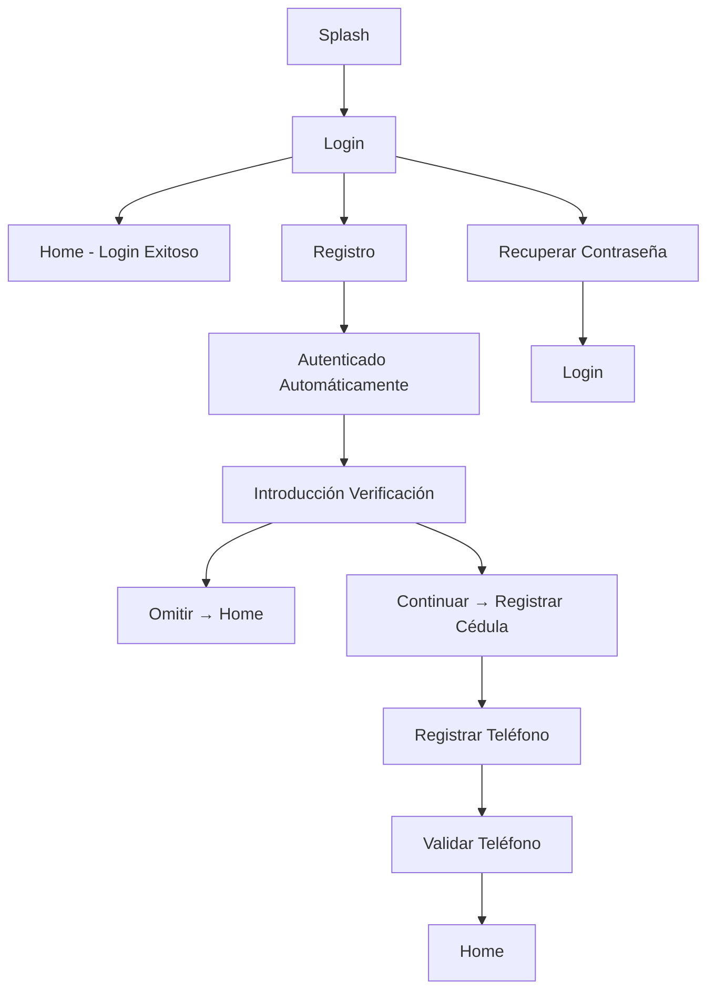

# Especificación Técnica - Módulo de Autenticación UnTigrito®

## 1. Resumen Ejecutivo

### 1.1 Objetivo
Implementar un sistema completo de autenticación para la aplicación UnTigrito® que incluya login, registro, recuperación de contraseña y verificación de identidad opcional, proporcionando una experiencia de usuario fluida y segura.

### 1.2 Alcance
- **Frontend**: 7 vistas de autenticación y verificación
- **Backend**: 8 endpoints de API (4 existentes + 4 nuevos)
- **Integración**: Google OAuth, sistema OTP, upload de archivos
- **Componentes**: Formularios responsivos usando shadcn/ui

### 1.3 Beneficios
- Autenticación segura y moderna
- Verificación de identidad opcional para mayor confianza
- Integración con Google para facilitar el registro
- Experiencia de usuario intuitiva y accesible

## 2. Arquitectura del Sistema

### 2.1 Flujo de Navegación



### 2.2 Estructura de Componentes

```
src/
├── app/
│   ├── splash/page.tsx
│   ├── login/page.tsx
│   ├── register/page.tsx
│   ├── forgot-password/page.tsx
│   ├── reset-password/page.tsx
│   └── verification/
│       ├── intro/page.tsx
│       ├── id/page.tsx
│       ├── phone/page.tsx
│       └── otp/page.tsx
├── components/
│   ├── auth/
│   │   ├── LoginForm.tsx
│   │   ├── RegisterForm.tsx
│   │   ├── ForgotPasswordForm.tsx
│   │   └── GoogleAuthButton.tsx
│   └── verification/
│       ├── IDVerificationForm.tsx
│       ├── PhoneVerificationForm.tsx
│       └── OTPVerificationForm.tsx
└── lib/
    ├── auth/
    │   ├── google-auth.ts
    │   └── otp-service.ts
    └── schemas/
        ├── auth.ts (actualizado)
        ├── verification.ts (nuevo)
        └── otp.ts (nuevo)
```

## 3. Especificaciones de Frontend

### 3.1 Vistas Principales

#### 3.1.1 Splash Screen
- **Ruta**: `/splash`
- **Propósito**: Pantalla de bienvenida con logo
- **Componentes**: Logo, nombre de la app, loading indicator
- **Navegación**: Auto-redirect a `/login` después de 2 segundos

#### 3.1.2 Login
- **Ruta**: `/login`
- **Propósito**: Autenticación de usuarios existentes
- **Campos**:
  - Email (requerido, validación de formato)
  - Password (requerido, mínimo 8 caracteres)
- **Acciones**:
  - Botón "Iniciar Sesión"
  - Enlace "¿Olvidaste tu contraseña?" → `/forgot-password`
  - Botón "Iniciar sesión con Google"
  - Enlace "¿No tienes cuenta? Regístrate" → `/register`

#### 3.1.3 Registro
- **Ruta**: `/register`
- **Propósito**: Creación de nuevas cuentas
- **Campos**:
  - Nombre completo (requerido, mínimo 2 caracteres)
  - Email (requerido, validación de formato)
  - Password (requerido, mínimo 8 caracteres)
  - Confirmar Password (requerido, debe coincidir)
- **Acciones**:
  - Botón "Registrarse"
  - Botón "Iniciar sesión con Google"
  - Enlace "¿Ya tienes cuenta? Iniciar Sesión" → `/login`

#### 3.1.4 Recuperar Contraseña
- **Ruta**: `/forgot-password`
- **Propósito**: Solicitar reset de contraseña
- **Campos**:
  - Email (requerido, validación de formato)
- **Acciones**:
  - Botón "Enviar enlace de recuperación"
  - Enlace "Volver al login" → `/login`

#### 3.1.5 Resetear Contraseña
- **Ruta**: `/reset-password`
- **Propósito**: Establecer nueva contraseña
- **Campos**:
  - Token (en URL)
  - Nueva Password (requerido, mínimo 8 caracteres)
  - Confirmar Password (requerido, debe coincidir)
- **Acciones**:
  - Botón "Establecer nueva contraseña"

### 3.2 Vistas de Verificación

#### 3.2.1 Introducción a Verificación
- **Ruta**: `/verification/intro`
- **Propósito**: Informar sobre beneficios de verificación
- **Contenido**:
  - Título: "Verifica tu identidad"
  - Descripción de beneficios
  - Requisitos: Cédula de identidad y teléfono
- **Acciones**:
  - Botón "Continuar" → `/verification/id`
  - Enlace "Omitir" → `/home`

#### 3.2.2 Verificar Cédula
- **Ruta**: `/verification/id`
- **Propósito**: Verificación de identidad
- **Campos**:
  - Número de cédula (requerido, formato venezolano)
  - Upload de imagen de cédula (requerido, JPG/PNG, máx 5MB)
  - Escaneo facial (requerido, base64)
- **Acciones**:
  - Botón "Verificar y continuar" → `/verification/phone`

#### 3.2.3 Registrar Teléfono
- **Ruta**: `/verification/phone`
- **Propósito**: Recopilar número de teléfono
- **Campos**:
  - Número de teléfono (requerido, formato venezolano)
- **Acciones**:
  - Botón "Continuar" → `/verification/otp`

#### 3.2.4 Validar Teléfono
- **Ruta**: `/verification/otp`
- **Propósito**: Verificar propiedad del teléfono
- **Campos**:
  - 5 campos de código OTP (requerido, numérico)
- **Acciones**:
  - Botón "Verificar Código"
  - Enlace "Reenviar código"

### 3.3 Componentes Reutilizables

#### 3.3.1 LoginForm
- Formulario de login con validación
- Manejo de errores
- Integración con Google Auth

#### 3.3.2 RegisterForm
- Formulario de registro con validación
- Confirmación de contraseña
- Integración con Google Auth

#### 3.3.3 IDVerificationForm
- Upload de archivos
- Escaneo facial (placeholder)
- Validación de cédula venezolana

#### 3.3.4 OTPVerificationForm
- 5 campos de entrada numérica
- Auto-focus entre campos
- Timer de reenvío

## 4. Especificaciones de Backend

### 4.1 Endpoints Existentes (Actualizar)

#### 4.1.1 POST /auth/login
```typescript
// Request
{
  email: string;
  password: string;
}

// Response
{
  user: User;
  token: string;
}
```

#### 4.1.2 POST /auth/register
```typescript
// Request
{
  name: string;
  email: string;
  password: string;
  confirmPassword: string;
}

// Response
{
  user: User;
  token: string;
}
```

#### 4.1.3 POST /auth/forgot-password
```typescript
// Request
{
  email: string;
}

// Response
{
  message: string;
}
```

#### 4.1.4 POST /auth/reset-password
```typescript
// Request
{
  token: string;
  newPassword: string;
}

// Response
{
  message: string;
}
```

### 4.2 Endpoints Nuevos

#### 4.2.1 POST /auth/google
```typescript
// Request
{
  token: string; // Google OAuth token
}

// Response
{
  user: User;
  token: string;
}
```

#### 4.2.2 POST /user/verify/id
```typescript
// Request (multipart/form-data)
{
  cedula: string;
  cedulaImage: File;
  faceScanData: string; // base64
}

// Response
{
  message: string;
  verified: boolean;
}
```

#### 4.2.3 POST /user/send-otp
```typescript
// Request
{
  phoneNumber: string;
}

// Response
{
  message: string;
  expiresIn: number; // seconds
}
```

#### 4.2.4 POST /user/verify/otp
```typescript
// Request
{
  phoneNumber: string;
  otpCode: string;
}

// Response
{
  message: string;
  verified: boolean;
}
```

### 4.3 Esquemas de Validación

#### 4.3.1 Auth Schemas (actualizar)
```typescript
export const RegisterRequestSchema = z.object({
  name: z.string().min(2),
  email: z.string().email(),
  password: z.string().min(8),
  confirmPassword: z.string(),
}).refine((data) => data.password === data.confirmPassword, {
  message: "Passwords don't match",
  path: ["confirmPassword"],
});

export const GoogleAuthRequestSchema = z.object({
  token: z.string(),
});
```

#### 4.3.2 Verification Schemas (nuevo)
```typescript
export const IDVerificationRequestSchema = z.object({
  cedula: z.string().regex(/^\d{7,8}$/),
  cedulaImage: z.string(), // base64
  faceScanData: z.string(), // base64
});

export const OTPRequestSchema = z.object({
  phoneNumber: z.string().regex(/^04\d{9}$/),
});

export const OTPVerificationRequestSchema = z.object({
  phoneNumber: z.string().regex(/^04\d{9}$/),
  otpCode: z.string().regex(/^\d{5}$/),
});
```

## 5. Especificaciones de Integración

### 5.1 Google OAuth
- Configuración de OAuth 2.0
- Validación de tokens en backend
- Manejo de errores de autenticación

### 5.2 Sistema OTP
- Generación de códigos de 5 dígitos
- Almacenamiento temporal en Redis
- Expiración de 5 minutos
- Integración con servicio SMS

### 5.3 Upload de Archivos
- Validación de tipos de archivo (JPG, PNG)
- Límite de tamaño (5MB)
- Almacenamiento en cloud storage
- Compresión de imágenes

## 6. Especificaciones de Seguridad

### 6.1 Autenticación
- JWT tokens con expiración
- Refresh tokens para renovación
- Validación de tokens en middleware

### 6.2 Validación
- Sanitización de inputs
- Validación de esquemas con Zod
- Rate limiting en endpoints sensibles

### 6.3 Datos Sensibles
- Encriptación de contraseñas (bcrypt)
- Almacenamiento seguro de archivos
- Logs de auditoría para verificaciones

## 7. Especificaciones de UX/UI

### 7.1 Diseño Responsivo
- Mobile-first approach
- Breakpoints: sm (640px), md (768px), lg (1024px)
- Componentes adaptativos

### 7.2 Accesibilidad
- Navegación por teclado
- Etiquetas ARIA
- Contraste de colores WCAG AA
- Texto alternativo en imágenes

### 7.3 Estados de Carga
- Loading spinners en botones
- Skeleton loaders para contenido
- Mensajes de error claros
- Feedback visual en formularios

## 8. Especificaciones de Testing

### 8.1 Testing Unitario
- Componentes React con Jest/RTL
- Funciones de utilidad
- Hooks personalizados

### 8.2 Testing de Integración
- Flujos completos de autenticación
- Integración con APIs
- Upload de archivos

### 8.3 Testing E2E
- Flujo completo de registro
- Flujo de verificación
- Recuperación de contraseña

## 9. Criterios de Aceptación

### 9.1 Funcionalidad
- [ ] Usuario puede registrarse con email/password
- [ ] Usuario puede iniciar sesión con credenciales
- [ ] Usuario puede recuperar contraseña
- [ ] Usuario puede verificar identidad (opcional)
- [ ] Usuario puede autenticarse con Google
- [ ] Usuario puede verificar teléfono con OTP

### 9.2 Rendimiento
- [ ] Carga inicial < 2 segundos
- [ ] Transiciones suaves entre vistas
- [ ] Upload de archivos < 10 segundos
- [ ] Respuesta de API < 500ms

### 9.3 Seguridad
- [ ] Contraseñas encriptadas
- [ ] Tokens JWT seguros
- [ ] Validación de inputs
- [ ] Rate limiting implementado

### 9.4 Usabilidad
- [ ] Formularios intuitivos
- [ ] Mensajes de error claros
- [ ] Navegación fluida
- [ ] Diseño responsive

## 10. Consideraciones Técnicas

### 10.1 Dependencias
- Next.js 14+ (App Router)
- React 18+
- TypeScript
- shadcn/ui
- Zod para validación
- Prisma para base de datos
- NextAuth.js para autenticación

### 10.2 Configuración
- Variables de entorno para APIs
- Configuración de CORS
- Configuración de CORS
- Configuración de rate limiting

### 10.3 Monitoreo
- Logs de autenticación
- Métricas de rendimiento
- Alertas de errores
- Dashboard de verificación